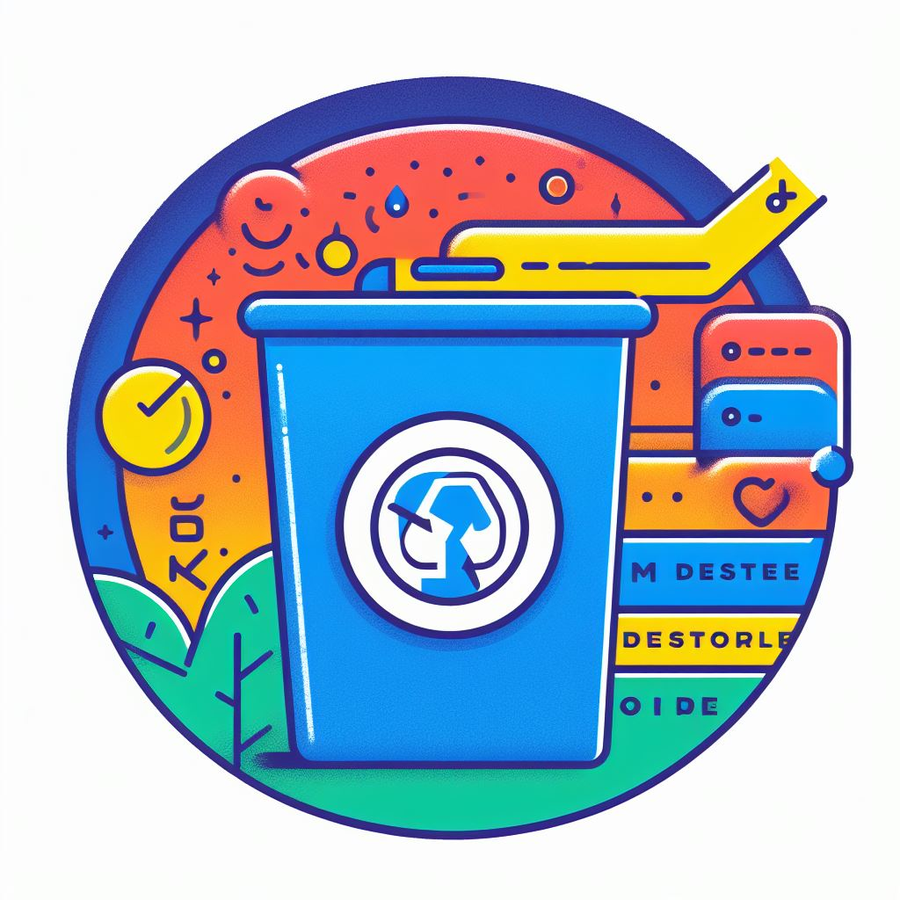

# Distenourize

Automatically remove old posts and comments from Lemmy

---

Mastodon has a setting to automatically remove old posts.
Lemmy has no such ability at the moment.
This tool will run automatically

## Requirements

- A working Rust installation
- An internet connection
- A Lemmy account

## Compilation

1. Clone this project
2. `cargo build --release`

## Running once

1. Log in to Lemmy in your browser
2. Extract the auth token
    1. Open your browser's dev tools (F12)
    2. Go to your cookies ("Storage")
    3. Copy the contents of the cookie named `jwt`
3. Check the call options: `cargo run --release -- --help`
4. Call the tool with the settings you like,
   i.e. `target/release/lemmy-old-comment-purge --username user@server --days-to-keep 14 --keep-favourites --edit-then-delete --edit-text 'This comment should be deleted soon' --sleep-time 500`

## Running as a service (systemd)

1. Copy distenourize.service and distenourize.timer to your systemd service definition directory (i.e.
   /etc/systemd/system or $HOME/.config/systemd/user)
2. Copy the compiled binary to a location accessible to your service (i.e. /opt/distenourize/)
3. Create a file containing the environment variables for your service (see below).
4. Update the timer file and the service file to point to the right paths. If you choose not to use an environment file,
   update the command line flags.

### Environment file

To shorten the command line and allow for packaging this tool into Docker, you can use environment variables instead of
command line arguments.
You can also combine the two, passing some data as environment variables and other data as command line options.
You can set the following environment variables:

| Environment variable | Command line option                              | Explanation                                                                                                                                                                                                           | Default                                                |
|----------------------|--------------------------------------------------|-----------------------------------------------------------------------------------------------------------------------------------------------------------------------------------------------------------------------|--------------------------------------------------------|
| USERNAME             | --username <USERNAME>                            | The username of the Lemmy user. Used mostly for logging. Required.                                                                                                                                                    | None                                                   |
| LEMMY_TOKEN          | --lemmy-token <LEMMY_TOKEN>                      | The JWT token to authenticate with Lemmy. Required.                                                                                                                                                                   | None                                                   |
| DAYS_TO_KEEP         | --days-to-keep <DAYS_TO_KEEP>, -k <DAYS_TO_KEEP> | The amount of days of content to keep.                                                                                                                                                                                | 14                                                     |
| KEEP_FAVOURITES      | --keep-favourites, -f                            | Set to `true` to keep saved posts, even if they're beyond the DAYS_TO_KEEP threshold                                                                                                                                  | false                                                  |
| KEEP_UPVOTES         | --keep-upvotes, -u                               | Keep posts and comments you've upvoted. Lemmy upvotes most posts and comments by default, but you can remove your own upvotes if you wish.                                                                            | false                                                  |
| KEEP_DOWNVOTES       | --keep-downvotes, -d                             | Keep posts and comments you've downvoted.                                                                                                                                                                             | false                                                  |
| EDIT_THEN_DELETE     | --edit-then-delete, -e                           | Edit and overwrite comments first, then call delete. This increases load on the server, but if buggy Fediverse servers don't implement deletes properly, this should remove the contents on most servers.             | true                                                   |
| EDIT_TEXT            | --edit-text <EDIT_TEXT>, -t <EDIT_TEXT>          | If EDIT_THEN_DELETE is enabled, this indicates what the text should be replaced with.                                                                                                                                 | [This comment has been deleted by an automated system] |
| SLEEP_TIME           | --sleep-time <SLEEP_TIME>, -w <SLEEP_TIME>       | The amount of milliseconds to sleep between network calls. Too many calls can cause the server to temporarily block access, or can overwhelm the server as a whole. Increase this number if you get too many failures | 100                                                    |
| -                    | --help, -h                                       | Show help                                                                                                                                                                                                             | None                                                   |
| -                    | --version, -V                                    | Show the version of the application                                                                                                                                                                                   | None                                                   |